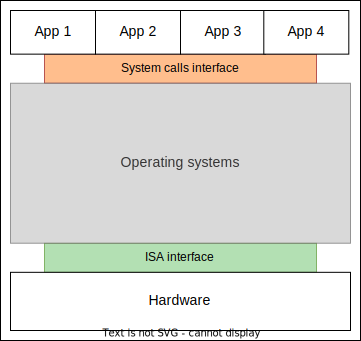
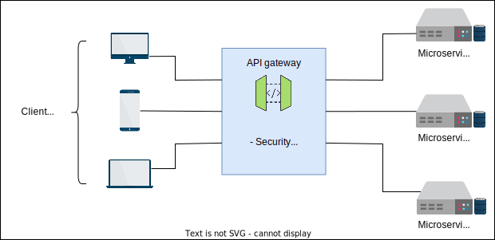

# Notes (Grokking the Product Architecture Design Interview)

> ## **Instruction Set Architecture (ISA)**
>
> This is an interface between hardware and software and is critical for software compatibility. For example, current generation x86 processors can still run older applications. Interfaces play a critical role in the compatibility of two components.
>
> **Instruction Set Architecture (ISA)** serves as an intermediary between the hardware and software of a computer system. ISA has two types of instructions. There are instructions that can be called directly by applications, and then there are privileged instructions that can’t be called directly. Therefore, the operating system (OS) on a machine places the privileged requests to the ISA, which knows how to get the task done. For example, when software gives an assignment to a variable `x`, both the compiler and the runtime translate that variable to a memory address and issue a set of instructions with the appropriate parameters to the hardware. Therefore, ISA acts as an interface that facilitates the operating system and abstracts the complexity of assigning a new value to a memory address.
>
> Computers utilize the idea of interfaces to enable communication between software components as well. For example, system calls are performed by application programs that are installed on top of operating systems. This, again, is possible through another interface that enables developers to request the services of operating systems in the form of system calls. Standardized interfaces are commonly used in the computing world between hardware components, for example, the PCI bus interface connecting peripherals to the motherboard. They are also used between classes of software—for example, public functions of a class—and between distributed systems, such as interface exposed by S3 storage service to the clients.
>
> Simple Storage Service (S3) is a storage service provided by Amazon Web Services (AWS), accessible through web interfaces.

## What is an Application Programming Interface?

An **application programming interface** (**API**) is an intermediary through which two software components communicate to share data and to get useful work done. As the name implies, exchanging information is possible because of the presence of a software interface between these components. The software components can reside on the same or different machines connected through a network.

Using an API, an application can request services from another application without understanding the architecture of other applications. The only thing the requesting application should know is how to place the request, in other words, it should understand the interface for placing the request.

Historically, APIs were invented to enable communication between software systems on the same machine. However, as network-connected computers became more common, the first network API was created in the 1970s for applications to communicate over a network. The services of network APIs were available for developers to consume using remote procedure calls (RPCs). After the Internet started to take off, developers desired a standardized approach for creating and exposing APIs, which led to the invention of web APIs in the late 1990s. Web APIs have become the de-facto standard of APIs for application communication, so much so that any discussion about APIs is assumed to be about web APIs. Today, web APIs are an accepted interface for remote applications to communicate and expose services over the Internet.

> **RPC**: An action-oriented (performs functions in terms of actions, such as getProfile) procedure call where the client passes the function name and required arguments to the server to retrieve data.

## Benefits of APIs

- **Complexity abstraction**: New services are often complex, with many moving parts. APIs help us to hide all that complexity within a service away from the consumer. Doing so has many benefits, such as the flexibility to change the internals of the service without changing the interface. With APIs, the caller of the service can focus on their application without worrying about the internal complexity of the calling service. The caller only has to focus on the interface and return data from the callee.

- **Improved modularity**: APIs aid the microservices architecture of applications by further breaking down applications into subsets of services. Developers use this modularity to design a flexible, maintainable, and reusable application.

- **Efficient development**: APIs have reduced the development time and the number of bugs by preventing developers from having to rewrite code for the same functionality. With APIs, developers can request services by making a simple call, without the need to rewrite code from scratch.

- **Controlled accessibility**: APIs provide applications with the flexibility to share limited data or information with a restricted number of users. Other techniques can be used to throttle the frequency of service usage.

APIs are the conduit between the user’s needs and the services provided. So they offer a good vantage point for usage and performance analytics. These analytics can help find any developing bottlenecks in the system.

## Types of APIs

- Public APIs are intended for developers to access publicly available data or services. Public APIs are freely accessible, but are limited to a few calls for a certain time period.

- Private APIs are designed for internal use only. The developers working within the company can use them to improve their products and services. They have the highest level of access and can see and update the complexity of the back-end system.

- Partner APIs are for users that have business relationships with the company that owns the APIs. These APIs have more robust security measures than public APIs. Generally, they are purpose-specific—such as giving access to a prepaid service—and are a widely used pattern in the ecosystem.

- Composite APIs allow developers to bundle the request call for different services and get a unified response from different requested resources. Composite APIs are handy when a developer needs data from different servers without making a separate API call to each server. It makes the system work faster and more efficiently by reducing the number of API calls and complexity.

## Types of APIs with Potential Users and Access Types

| API type | Authentication type | Potential users | Examples |
| -------- | ------------------- | --------------- | -------- |
| Public APIs | Publicly accessible with API keys | B2C (business-to-consumer) | Google Maps, Weather APIs |
| Private APIs | No authentication | B2B (business-to-business), B2C, B2E (business-to-employee) | Educative APIs for creating courses |
| Partner APIs | Authorized access with access tokens/license | B2B, B2C | Amazon APIs for partners |
| Composite APIs | Depends on the connected API’s authentication | B2B, B2C, B2E | Payment APIs (Stripe, PayPal) |

## API gateway

Modern software applications prefer microservices over monolithic architecture. This is because their rich features require multiple services to process tasks with added flexibility. The microservice architecture is easy to manage and develop and provides modularity to the application compared to the monolithic.

### Monolithic architecture

A **monolithic architecture** is one in which all the components of an application, such as, frontend, backend, databases, and any other component, are embedded in a single codebase. The application is developed, updated, and deployed as a monolith.

- **Advantages**:
  - Easy to develop and deploy as the application is developed as a single executable app with fewer components to manage during deployment
  - Simple to test and maintain the application because all the components are coupled together
  - Fewer security issues because the data is processed within a single unit, producing a response with low latency
  - Low initial cost of the system
  - Resources for development are less costly

- **Disadvantages**:
  - Hard to scale a monolithic application because all the components are coupled; to make changes, we need to update the whole system or application
  - Need to deploy the complete application after the update
  - Limitation of size and complexity
  - CI/CD is difficult
  - Problems with reliability—the whole application can be down because of an issue

### Microservice architecture

A **microservice** is an architecture in which an application is divided into smaller services. These services handle smaller functionalities and data of the application by communicating with each other using defined protocols. They can be physically separated but connected through protocols.

- **Advantages**:
  - Easy to manage larger applications due to decoupled services  
  - Easy development and deployment strategy as each microservice is updated individually  
  - Reliable as a single service failure can’t bring down the whole application  
  - CI/CD is easier than monolithic  

- **Disadvantages**:
  - Costly in terms of services, development, and networking
  - More complex to manage due to its distributed attributes
  - Security issues as communication between services can make data vulnerable
  - Less secure than monolithic

In a scenario where a client application must interact with multiple microservices at a time, a typical approach would be to make a separate API call for each microservice. This impacts resource consumption, performance, and task time. The **API gateway** comes in to help by acting as a single entry point for all the API requests. It sits between the microservices and clients, acting as a gateway.

The API gateway takes the client’s calls and routes them to the appropriate microservice by processing the parameters in composite API calls. It retrieves the responses from all microservices and sends a unified response to the client’s requests. Most applications depend on APIs; therefore, cyber attacks target them because they can expose valuable users and system data. It is of utmost importance to protect APIs from unauthorized access. An API gateway plays the following essential roles:

    It provides security, authentication, and rate limiting to protect APIs from overuse.

    It provides an analysis mechanism to monitor the behavior of the users with the help of monitoring tools.

    It’s helpful in microservice architecture to disseminate a single API call to multiple services and compile an answer in return.

    It may provide stabilization to the system by balancing the network traffic.
